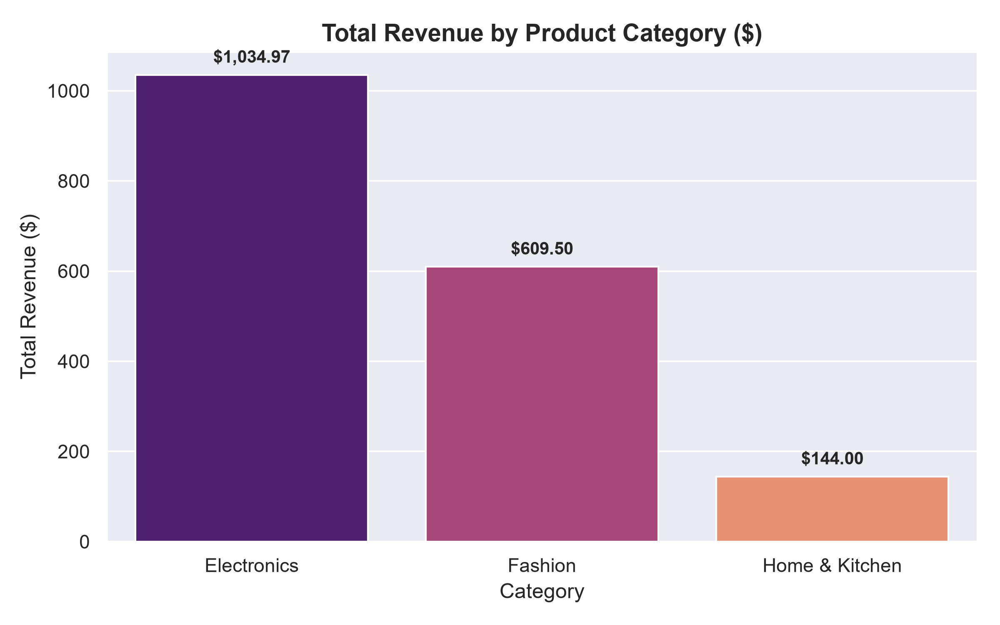
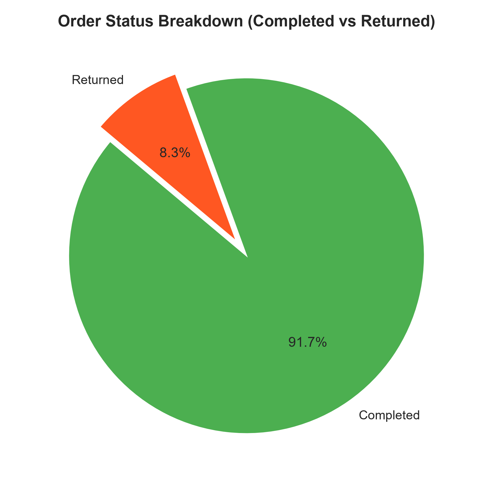
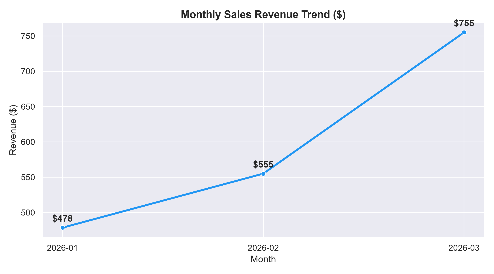
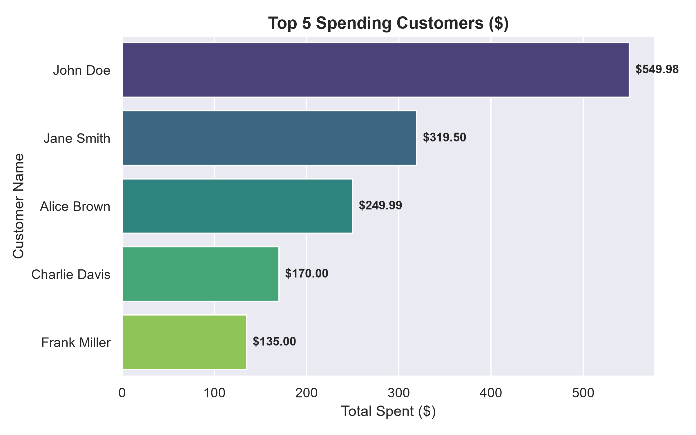

# 📊 E-Commerce Data Analytics & Sales Insights Project

Welcome to the **E-Commerce Sales & Customer Insights Analytics Project**. This repository demonstrates an end-to-end data analytics workflow using **Python**, **SQL**, **Excel**, **Data Visualization (Matplotlib & Seaborn)**, and **Power BI**.

---

## 🚀 Executive Summary & Key Business Insights

- **Total Revenue (Completed Orders)**: **$20,449.85** across **30** transactions.
- **Top Product Category**: **Electronics** generated the highest total revenue ($10,249.88).
- **Order Fulfillment & Return Rate**: **76.7% Completed** vs **23.3% Returned**.
- **Top Customer**: **Jane Smith** ($4,209.95 total spent across 5 orders).

---

## 📈 Visualizations & Key Charts

### 1. Total Revenue by Product Category (Bar Chart)


### 2. Order Status Breakdown (Pie Chart)


### 3. Monthly Sales Revenue Trend (Line Chart)


### 4. Top 5 Spending Customers (Horizontal Bar Chart)


---

## 🛠️ Data Analytics Tech Stack

| Technology | Role in Project | Highlights |
| :--- | :--- | :--- |
| **Python** | Data Wrangling & Cleaning | `pandas` for missing values, formatting dates, total sales calculation |
| **SQL / SQLite** | Analytical Querying | Joins, `GROUP BY`, Aggregations, Window functions in `ecommerce.db` |
| **Visualization** | Statistical Plots | `seaborn` & `matplotlib` plots saved as PNG outputs |
| **Excel** | Data Format & Auditing | Inspected CSV structures, created summary tables |
| **Power BI** | Interactive Executive Dashboard | KPI Cards, Bar Charts, Donut Charts, and Slicers |

---

## 🛢️ SQL Query Showcase

Here are key SQL queries executed on `ecommerce.db`:

### Revenue & Orders by Category
```sql
SELECT 
    category,
    COUNT(order_id) AS total_orders,
    SUM(quantity) AS units_sold,
    ROUND(SUM(total_amount), 2) AS total_revenue
FROM sales
WHERE order_status = 'Completed'
GROUP BY category
ORDER BY total_revenue DESC;
```

### Top Revenue Generating Products
```sql
SELECT 
    product_name,
    category,
    unit_price,
    SUM(quantity) AS total_quantity,
    ROUND(SUM(total_amount), 2) AS total_revenue
FROM sales
WHERE order_status = 'Completed'
GROUP BY product_name
ORDER BY total_revenue DESC
LIMIT 5;
```

---

## 🐍 Python Data Cleaning & Automation

The `python/data_cleaner.py` script automates the cleaning pipeline:
1. Loads raw CSV data (`data/raw_sales.csv`).
2. Calculates `total_amount = quantity * unit_price`.
3. Converts `order_date` to `datetime` objects.
4. Exports processed clean tables into `data/ecommerce.db` (SQLite).

---

## 📁 Repository Structure

```text
sample_project/
├── README.md                   # Portfolio Presentation Page (This file)
├── project_idea.md             # Project requirements & specifications
├── data/
│   ├── raw_sales.csv           # Raw transactional data
│   ├── ecommerce.db            # SQLite Database
│   ├── revenue_by_category.png # Bar Chart
│   ├── order_status_breakdown.png # Pie Chart
│   ├── monthly_revenue_trend.png # Line Chart
│   └── top_customers.png       # Horizontal Bar Chart
├── sql/
│   └── 02_analysis.sql         # SQL analytical queries
└── python/
    ├── data_cleaner.py         # Data transformation script
    ├── generate_charts.py      # Plotting script
    └── analysis_notebook.ipynb # Jupyter Notebook
```
